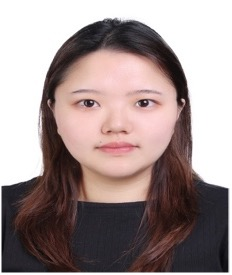

## People

<table class="people">
  <thead>
    <tr>
        <th class="d-large" colspan="3"><h3>Founders</h3></th>
        <th class="d-small"><h3>Founders</h3></th>
    </tr>
  </thead>
  <tbody>
    <tr>
        <td>
            <a href="https://www.qut.edu.au/">
                  
                <h3>Dr. Chun Ouyang</h3>
                
                <!-- If you need subtitile, using span tage to add it here -->
            </a>
        </td>
        <td>
            <a href="https://www.qut.edu.au/">
                  
                <h3>Dr. Catarina Moreira</h3>
                
            </a>
        </td> 
        <td>
            <a href="https://www.qut.edu.au/">
                  
                <h3>Dr. Renuka Sindhgatta</h3>
            </a>
        </td>
    </tr>
  </tbody>
  <thead>
    <tr>
        <th class="d-large" colspan="3"><h3>Collaborators</h3></th>
        <th class="d-small"><h3>Collaborators</h3></th>
    </tr>
  </thead>
  <tbody>
    <tr>
        <td>
            <a href="https://www.qut.edu.au/">
                  
                <h3>A\Prof. Yue Xu.</h3>
            </a>
        </td> 
        <td>
            <a href="https://www.qut.edu.au/">
                  
                <h3>Prof. Joaquim Jorge</h3>
            </a>
        </td>
        <td>
            <a href="https://www.qut.edu.au/">
                  
                <h3>Prof. Will van der Aalst</h3>
            </a>
        </td>
    </tr>
  </tbody>
  <thead>
    <tr>
        <th class="d-large" colspan="3"><h3>HDR Students</h3></th>
        <th class="d-small"><h3>HDR Students</h3></th>
    </tr>
  </thead>
  <tbody>
    <tr>
        <td>
            <a href="https://www.qut.edu.au/">
                  
                <h3>Mythreyi Velmurugan</h3>
            </a>
        </td>
        <td>
            <a href="https://www.qut.edu.au/">
                  
                <h3>Yu-Liang (Leon) Cho</h3>
            </a>
        </td>
        <td>
            <a href="https://www.qut.edu.au/">
                  
                <h3>Peng (Kenny) Yu</h3>
            </a>
        </td>
    </tr>
    <tr>
        <td>
            <a href="https://www.qut.edu.au/">
                  
                <h3>Bemali Wickramanayake</h3>
            </a>
        </td>
        <td>
            <a href="https://www.qut.edu.au/">
                  
                <h3>Jia (Jenny) Wei</h3>
            </a>
        </td>
    </tr>
  </tbody>
  <thead>
    <tr>
        <th class="d-large" colspan="3"><h3>Research Assistance</h3></th>
        <th class="d-small"><h3>Research Assistance</h3></th>
    </tr>
  </thead>
  <tbody>
    <tr>
        <td>
            <a href="https://www.qut.edu.au/">
                  
                <h3>Chihcheng (Richard) Hsieh</h3>
            </a>
        </td>
    </tr>
  </tbody>
   <thead>
    <tr>
        <th class="d-large" colspan="3"><h3>Honors Student</h3></th>
        <th class="d-small"><h3>Honors Student</h3></th>
    </tr>
  </thead>
  <tbody>
    <tr>
        <td>
            <a href="https://www.qut.edu.au/">
                  
                <h3>Zhipeng (Zippo) He</h3>
            </a>
        </td>
    </tr>
  </tbody>
</table>
